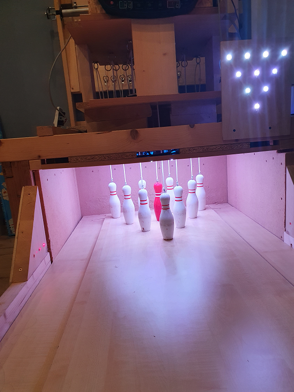
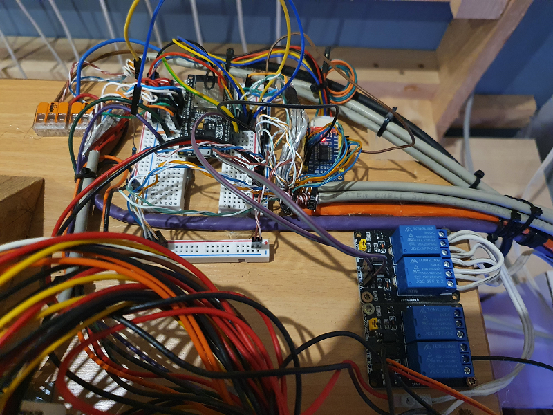
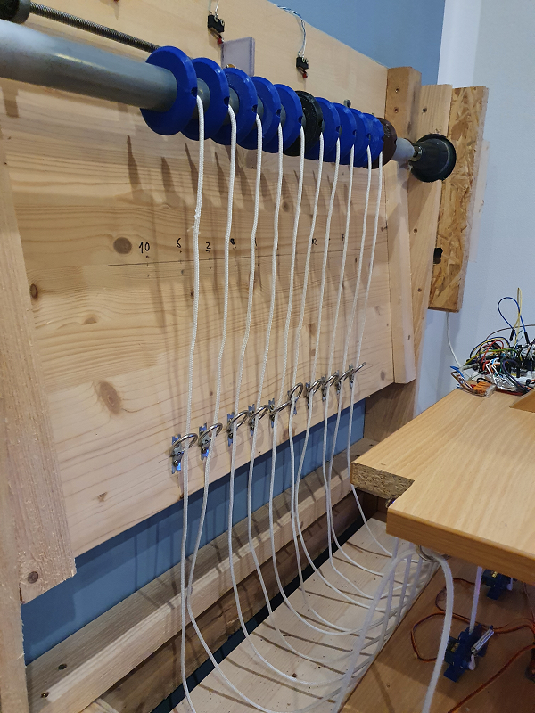
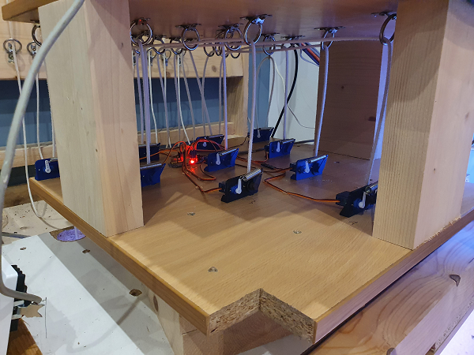

# Willkommen zu meinem scape-bowling project

Mein Kind liebt Bowling, und irgendwie hatte ich zu viel Zeit....
Was eigentlich mur ein Gag sein sollte, hat mich immer mehr gereizt. Die Bahn ist 5m lang und 55cm breit+ Rinne und Begrenzung.
Die Pins sind 17,5 cm groß, geworfen wird mit einer 120mm Kegelkugel.

Derzeit verbaut:
- 1x esp32 mit esphome
- 1x PC Netzteil für 3,3V und 5V
- Motor
  - 1x Motor für die Winde angesteuert über 2 Relais
  - 10x Servomotoren zum blockieren der Pins(Pins oben lassen)
- Sensoren
  - 3x Sensorschalter für die Windenstellung (pins am mcp23017)
  - 10x Reedkontakte unterhalb der Pins und Magnete in den Pins (direkt am ESP32)
  - 3x Wurfsensoren (Laserlichtschranke mit Optischen Sensoren im 5cm Abstand, über mcp23017)
  - BME280 (Tempmultisensor, hatte ich noch übrig)
- Beleuchtung
  - 10 WS2811 Fast-Led für die StatusLeds
  - 40 WS2811 Fast-Led für die Pinbeleuchtung (4 pro Pin)

